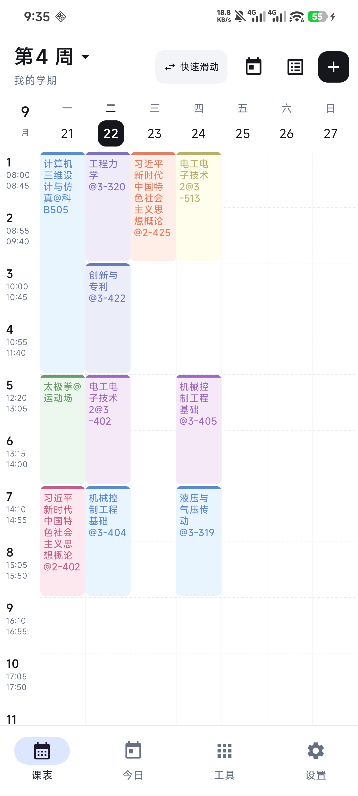
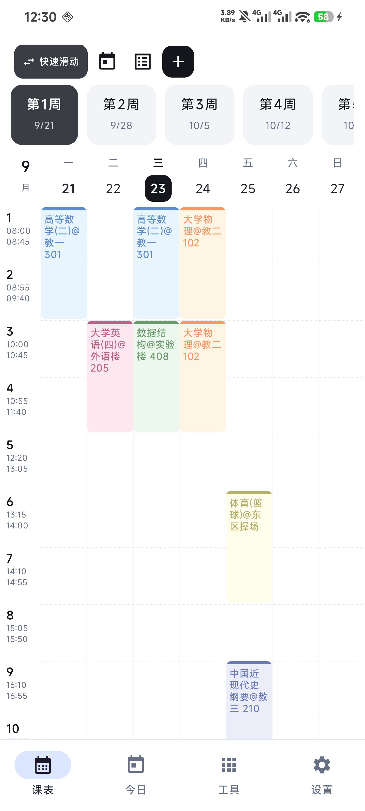
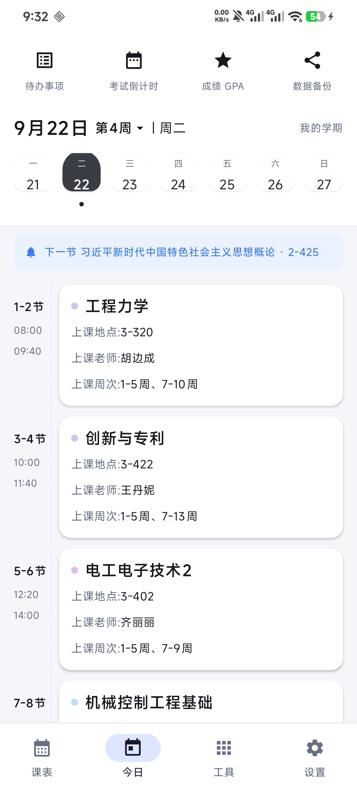
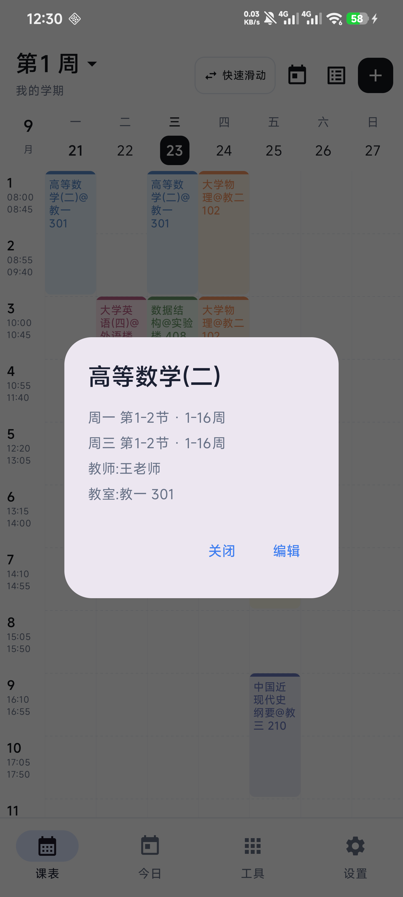

# 我的课程表 · MySchedule

[](https://github.com/6lanshen-dongye/MySchedule/releases) [](LICENSE) [](https://github.com/6lanshen-dongye/MySchedule)

一个**离线优先**的 Android 课表应用，用 Jetpack Compose 从零写成，界面参考「超级课程表」。
支持从**正方教务系统**（`jwglxt`）一键导入课表，也可以完全手动添加。

> 所有数据只存在你自己的手机里：没有账号、没有服务器、不申请任何敏感权限。

## ✨ 特性

### 课表页
- 一周 7 天 × 最多 12 节的网格，左侧固定「节次 / 起止时间」列
- 课程块显示 `课程名@教室`，顶部色条 + 柔和底色，颜色可自选
- **整周顺滑左右平移**切换周次，一次滑动只走一周
- **日期条自由拖动**：像水流一样连续滑动，松手自动吸附对齐到周一
- 点日期 → 弹出**当天课程清单**（节次 + 时间 + 地点 + 老师）
- 点空白格 → 直接给那一格加课

### 「快速滑动」（周次速览）
- 右上角常驻小部件，**点一下变深色展开**，再点一下变白收起
- 展开后当周标签隐去，**周条独占整行并放大**展示 `第N周 + 周起始日`
- 拖动周条 / 日期条时**只预览**（日期条、周条高亮、顶部大组件跟着走），**点某天或某个周卡片才真正切换课表**

### 今日页
- 当天课程时间轴：左侧节次导轨 + 右侧白色课程卡片（地点 / 老师 / 上课周次）
- 顶部「下一节 课程名 · 教室」提醒条
- 左右滑动切换前 / 后一天，跨周自动换周
- 日期条可自由拖动；「今天」下面有小圆点，点一下回到当前日期

### 教务系统导入
- App 内打开学校教务系统 → 你**自己**登录（App 不保存也不接触密码）
- 注入脚本把课表页面解析成 JSON → 预览 → 追加导入 / 覆盖导入
- 兼容正方 `jwglxt` 的多种页面版式（表格视图 / 列表视图 / 无字段标签的纯行文本）
- 自动清洗脏数据：从课程名里剥出周次、上课地点、老师

### 其它
- 学期设置：开学日期（第一周周一）、总周数、每天作息时间
- 单双周、一门课多个时间段、冲突检测、批量管理
- 学习工具：待办事项、考试 DDL、成绩 GPA
- 数据备份 / 恢复（导出 JSON）
- 深色模式跟随系统

## 📱 截图

| 课表 | 快速滑动 | 今日 | 课程详情 |
|---|---|---|---|
|  |  |  |  |

## 👌 操作速查

| 位置 | 操作 | 效果 |
|---|---|---|
| 课表页 | 左右滑动网格 | 切换上 / 下一周 |
| 课表页 | 拖动日期条 | 连续滑动；松手吸附到周一，一次最多翻一周 |
| 课表页 | 点日期 | 弹出当天课程清单 |
| 课表页 | 点右上角 **⇄ 快速滑动** | 展开周条（变深色），可自由浏览周次 |
| 课表页 | 点 **📅** / 点「第N周 ⌄」 | 回到本周 / 选周 |
| 课表页 | 点右上角 **＋** | 快速滑动 / 教务系统导课 / 手动添课 / 蹭课 |
| 今日页 | 左右滑动卡片 | 切换前 / 后一天 |
| 今日页 | 拖动日期条 / 点周卡片 | 浏览；点某天才切过去 |
| 今日页 | 点「今天」下的小圆点 | 回到当前日期 |

## 📦 下载安装

**[⬇️ 下载 MySchedule-v1.0.apk](https://github.com/6lanshen-dongye/MySchedule/releases/download/v1.0/MySchedule-v1.0.apk)** · 10.5 MB · Android 8.0+

也可以到 [Releases](../../releases) 页面挑选其它版本。

1. 把 APK 传到手机（微信 / QQ / 数据线均可），点开安装；系统提示「未知来源」时允许即可
2. 首次进入建议先去**设置**把「开学日期（第一周周一）」改成你学校的，周次就全对了

> 国内直连 GitHub 下载较慢的话，可以在链接前加加速前缀，例如
> `https://gh-proxy.com/https://github.com/6lanshen-dongye/MySchedule/releases/download/v1.0/MySchedule-v1.0.apk`

## 🔨 从源码构建

**环境要求**

- JDK 17
- Android SDK（`compileSdk 34`）
- 无需单独安装 Gradle，仓库自带 Wrapper（Gradle 8.9）

**步骤**

```bash
git clone https://github.com/<your-name>/MySchedule.git
cd MySchedule

# 指向你本机的 Android SDK（这个文件不会进仓库）
echo "sdk.dir=/path/to/Android/sdk" > local.properties

# 打一个可以直接安装的 debug 包
./gradlew assembleDebug
# 产物：app/build/outputs/apk/debug/app-debug.apk
```

**关于 release 签名（可选）**

仓库里**不含任何签名密钥与密码**。如果你想打正式签名的 release 包，自己在 `local.properties` 里补上（该文件已被 `.gitignore` 排除）：

```properties
sdk.dir=/path/to/Android/sdk
RELEASE_STORE_FILE=keystore/my.jks
RELEASE_STORE_PASSWORD=你的密码
RELEASE_KEY_ALIAS=你的别名
RELEASE_KEY_PASSWORD=你的密码
```

没配置也能构建 —— 只是 release 包不签名而已。

## 🧱 技术栈

| | |
|---|---|
| 语言 | Kotlin 2.0.21 |
| UI | Jetpack Compose（Material 3，compose-bom 2024.09.03） |
| 构建 | AGP 8.5.2 / Gradle 8.9 / minSdk 26 |
| 序列化 | kotlinx.serialization（课表 JSON） |
| 存储 | SharedPreferences（单文件 JSON，无数据库、无 Room） |
| 导入 | WebView + `evaluateJavascript` 注入解析脚本 |

## 📁 目录结构

```
app/src/main/java/com/myschedule/app/
├── MainActivity.kt              入口
├── data/
│   ├── Models.kt                数据模型（学期 / 课程 / 时间段）
│   ├── AppStore.kt              全局状态 + 持久化
│   ├── ScheduleLogic.kt         日期与周次计算、当天课程
│   ├── TimetableImport.kt       导入结果解析、周次表达式
│   └── CourseCleaner.kt         脏数据清洗（从课程名剥周次/地点/老师）
└── ui/
    ├── AppRoot.kt               底部导航与页面切换
    ├── schedule/                课表页 + 课程编辑
    ├── today/                   今日页
    ├── settings/                学期 / 作息 / 数据管理
    ├── tools/                   待办、考试、成绩
    ├── imports/
    │   ├── ImportActivity.kt    教务系统 WebView 容器
    │   └── ScrapeScript.kt      注入页面执行的抓取脚本
    └── common/                  日期条、周条、配色等公共组件
```

## 🕸 教务系统导入是怎么实现的

1. `ImportActivity` 用独立 WebView 打开学校教务系统，**由你自己登录**；
2. 点「抓取课表」时通过 `evaluateJavascript` 注入 `ScrapeScript.SCRAPE_JS`；
3. 脚本在页面里遍历所有 `<table>`，识别课程块（`timetable_con` / 列表视图 / 纯文本行），
   剥出「课程名、老师、周次、节次、教室」并汇总成 JSON 返回；
4. Kotlin 侧反序列化 → 预览对话框 → 追加导入或覆盖导入；
5. 解析失败时会把页面结构与解析轨迹写到
   `Android/data/com.myschedule.app/files/scrape_debug.txt`，方便提 issue。

> **不需要改代码就能用**：导入页里直接填你学校的教务系统网址即可（填过一次会记住）。
> 页面上的两个快捷按钮会填入**通用正方模板**（`https://jwglxt.example.edu.cn/...`），
> 把 `example.edu.cn` 换成你学校的域名就行。
> 想换默认模板的话，改 `ui/imports/ImportActivity.kt` 里的
> `ZHENGFANG_KB_TEMPLATE` / `ZHENGFANG_HOME_TEMPLATE` 两个常量；
> 解析脚本本身对正方 `jwglxt` 各版本通用。
脚本对页面版式做了较多兼容（字段带不带标签、run-on 长文本、`<hr>` 分隔、隐藏网格表等），
对应回归用例在 `tools/parser-tests/`。

## 🔒 隐私

- 课表、待办、成绩等全部保存在本机 `SharedPreferences`，**不联网上传**；
- 只申请网络权限（用于打开你指定的教务系统页面），不申请定位 / 通讯录 / 存储等敏感权限；
- **不保存你的教务系统账号密码** —— 登录在系统 WebView 中完成，凭据只存在于 WebView 的会话 Cookie；
- 仓库不含任何个人信息、签名密钥或抓取产物。

## 🧪 解析回归测试

`tools/parser-tests/` 里是从 Kotlin 源码抽出注入脚本、在 Node + jsdom 上运行的解析回归用例：

```bash
cd tools/parser-tests
npm i jsdom          # 仅首次
node parse_test_zf52.js
node parse_test.js
# 每个用例会打印 ok / blocks / times
```

## 🗺 Roadmap

- [ ] 桌面小组件
- [ ] 课程提醒通知
- [ ] 课表截图分享
- [ ] 适配更多教务系统版式（欢迎附 `scrape_debug.txt` 提 issue）

## 🤝 贡献

Issue 和 PR 都欢迎。提解析相关问题时请附上 `scrape_debug.txt`（里面只有 HTML 结构，
**提交前请先删掉可能含个人信息的字段**）。

## 📄 协议

[MIT](LICENSE) © 2026 MySchedule contributors

## ⚠️ 免责声明

本项目为个人学习与自用项目，**与任何学校、教务系统厂商均无关联**，也未获得其授权或认可。
请遵守你所在学校的信息系统使用规定；导入功能仅用于获取你本人有权查看的课表数据。
